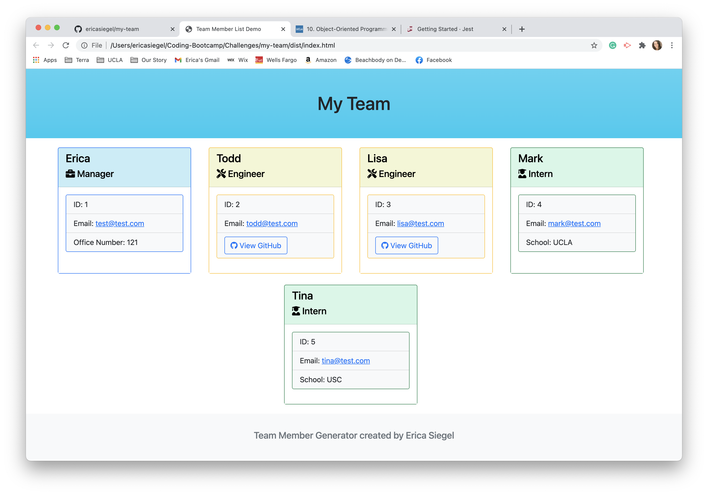
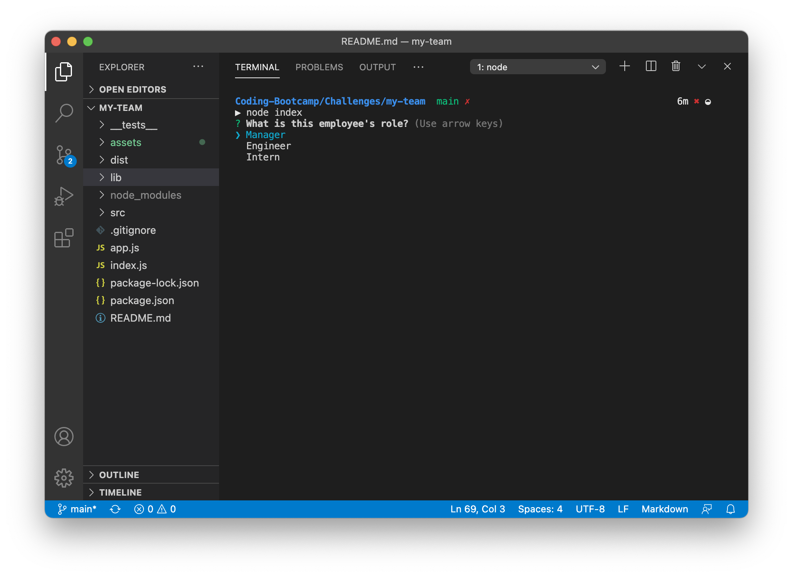
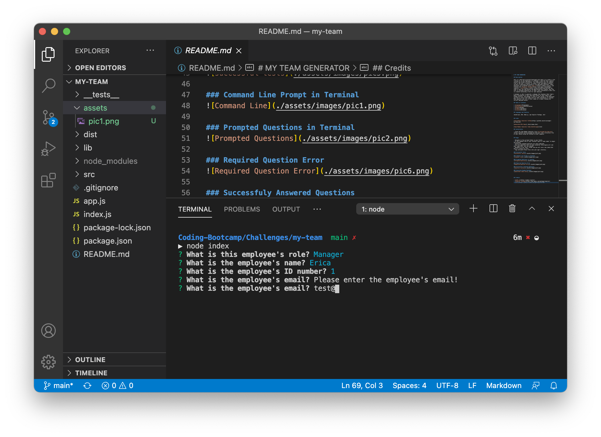
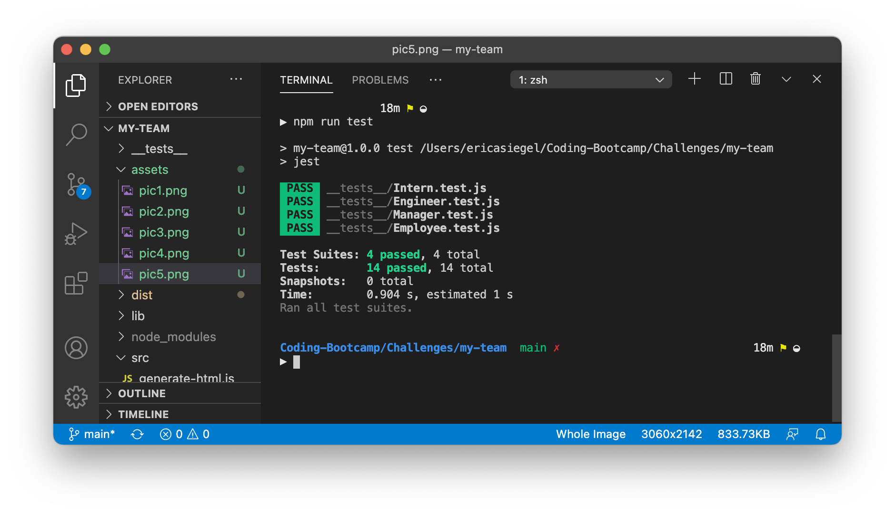
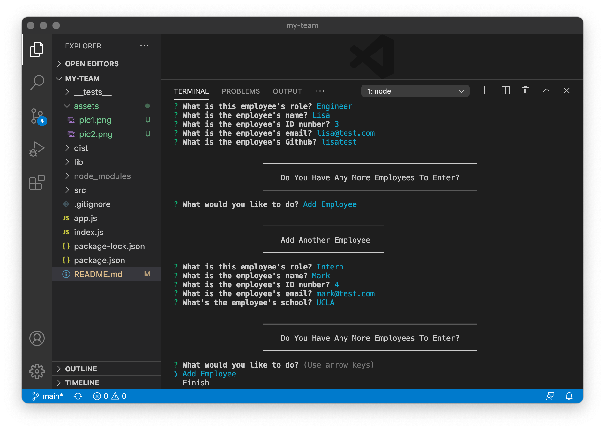
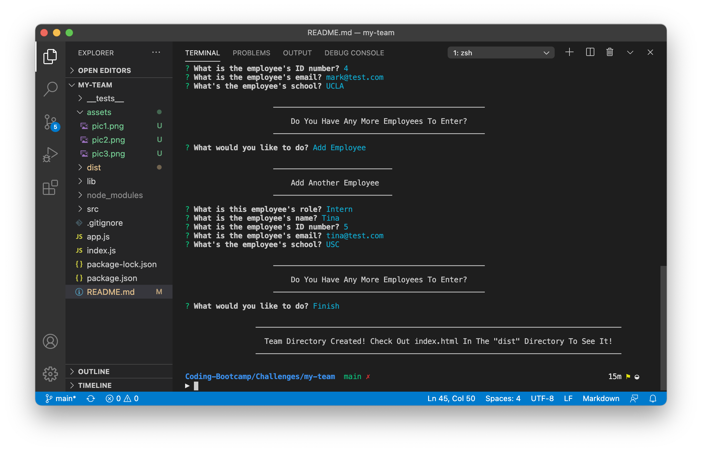

# MY TEAM GENERATOR

## Description 

This is a back-end projected developed with node.js to create a site listing all of the employees in a Manager's team and their general contact and GitHub information. This application uses the command line in the user's Terminal to create a html web page by asking a variety of questions pertaining to the employees positions. These questions are prompted using [node.js](https://nodejs.org/en/) and created with [Inquirer Package](https://www.npmjs.com/package/inquirer). [Jest](https://jestjs.io/docs/en/getting-started) was used to test the code before the application was created. Once the user is finished inputing all of their staff information a html file is created containing a card for each employee. 

A manager is able to generate a webpage that displays their team's basic information so that they have access to their emails and GitHub profiles. The manager is able to just answer a few questions and then an entire html page with all that information is created. Each specific job role is color coded so it makes finding the correct employee easier. 

## Table of Contents

* [Languages](#languages)
* [Installation](#installation)
* [Usage](#usage)
* [Credits](#credits)
* [License](#license)

## Languages and Features

JavaScript, ES6, Node.js, npm Inquirer Package, Jest

## Links

[Team Member Generator GitHub](https://github.com/ericasiegel/my-team.git)

[Generated HTML Demo](./dist/index.html)

[Team Member Generator Video Walkthrough](link)

## Installation

- Clone the Team Member Generator from [ericasiegel/my-team.git](https://github.com/ericasiegel/my-team.git) into a directory file of your choice using the Terminal on your computer.

## Usage 

- Navigate to the my-team folder in your Termal.
- In the command line of your Terminal type in "node index" to begin the program.
- Follow the prompted questions for every employee.
- Once the questions have all been answered, the program will end and 'index.html' will be created. 
- Navigate to the "dist" folder and you will see a new index.html and it's styles.css file.
- Copy and paste those files into your app's drectory.

### Successful Tests

### Command Line Prompt in Terminal

### Prompted Questions in Terminal

### Required Question Error

### Successfuly Answered Questions

### Generated Readme Markdown

## Credits

- [node.js](https://nodejs.org/en/)
- [Inquirer Package](https://www.npmjs.com/package/inquirer)
- [Jest](https://jestjs.io/docs/en/getting-started)

